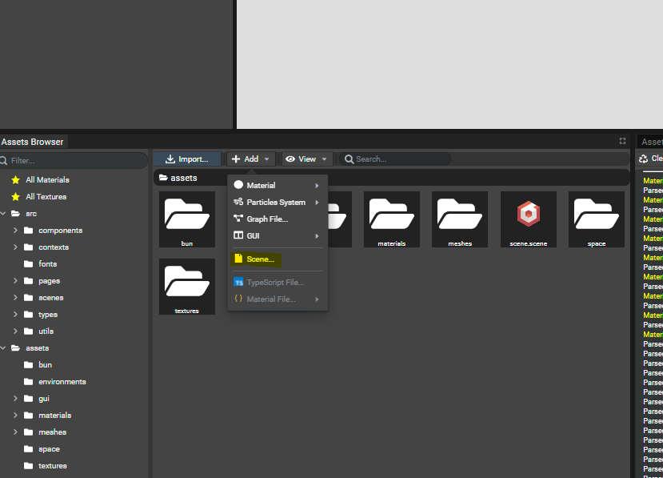

# Adding Scene To Workspace

*Note: since Editor v4.4.0 the way to create new scenes changed. It is highly recommanded to update to to at least this version.*

By default, a newly created workspace contains one scene. Per workspace, it is possible to manage multiple
scenes in order to, for example, split levels of a game.

A newly created scene is always empty and ready to receive new assets etc.

## Creating A New Scene
To create a new scene in the workspace, just go to the `Assets Browser` panel and select `Add -> Scene...`.

Once clicked, a popin appears to ask for the name of the scene. Once the button `Finish` is clicked,
the new scene is being created on the file system. Then, the Editor will ask to continue working
on the current scene or load the new one.

Once a scene has been created, a new folder located at *"`workspacePath`/projects/`sceneName`"* is created containing
all the resources of the scene. Once the new scene is loaded and generated, a new folder located at
 *"`workspacePath`/scenes/`sceneName`"* is created.
