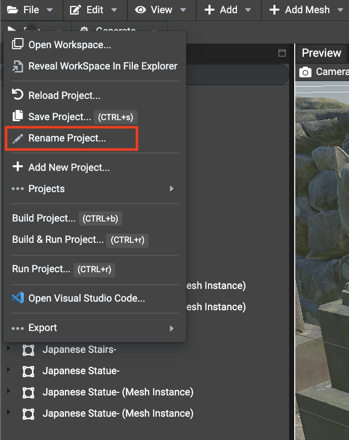

# Renaming A Project

To rename a project, just go to the `File` menu in the toolbar, select `Rename Project...` and provide the new name of the project:



Once accepted, the following folders will be renamed:
- *`workspacePath`/projects/`oldname`* ->  *`workspacePath`/projects/`newname`* 
- *`workspacePath`/scenes/`oldname`* -> *`workspacePath`/scenes/`newname`*
- *`workspacePath`/src/scenes/`oldname`* -> *`workspacePath`/src/scenes/`newname`*

In case the folders already exists (in other words, if the project already exists) then the operation is aborted.

## Renaming imports in sources

Once a project has been renamed, the paths set in the code must be updated.

For example, a scene named `scene1` renamed to `scene2`, the following import must be updated:
```typescript
import { runScene } from "./scenes/scene1";
```

should be renamed to:
```typescript
import { runScene } from "./scenes/scene2";
```

Do the same for all other imports that are not valid anymore. Once done, webpack build will be valid
and the project will be up to work.

## Renaming paths in loaders in sources
As well as the TypeScript imports, paths to scenes being loaded in the code must have their paths updated.

For example:
```typescript
const rootUrl = "./scenes/scene1/";

SceneLoader.Append(rootUrl, "scene.babylon", this.scene, () => {
	...
});
```

should be renamed to:
```typescript
const rootUrl = "./scenes/scene2/";

SceneLoader.Append(rootUrl, "scene.babylon", this.scene, () => {
	...
});
```
