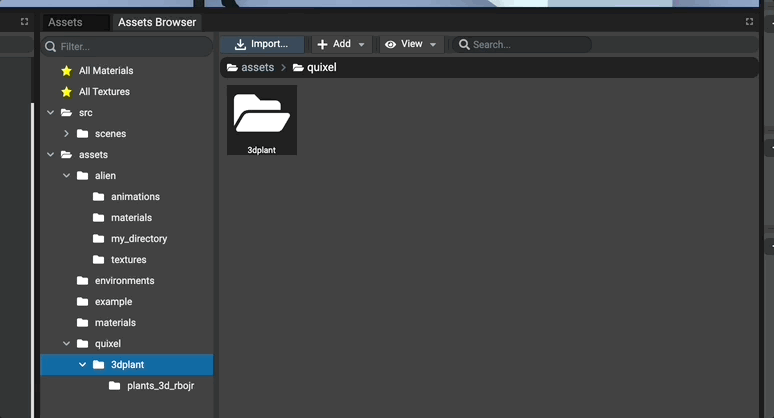
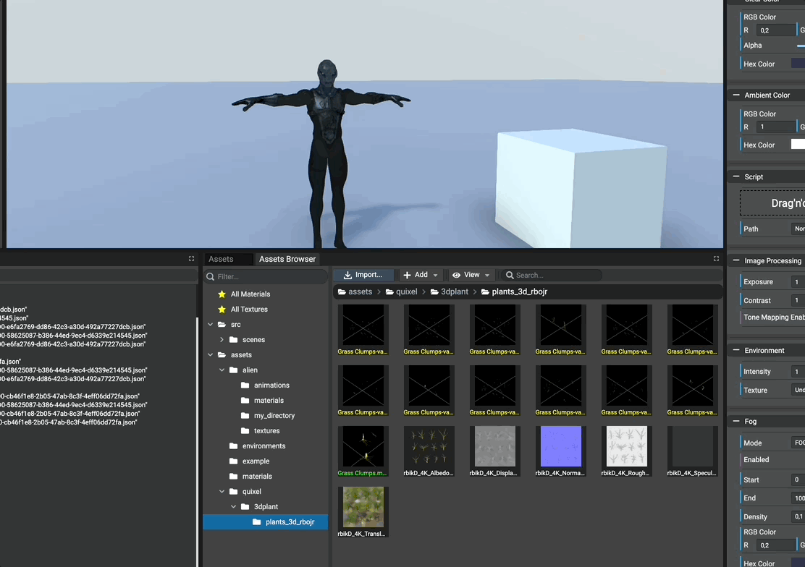
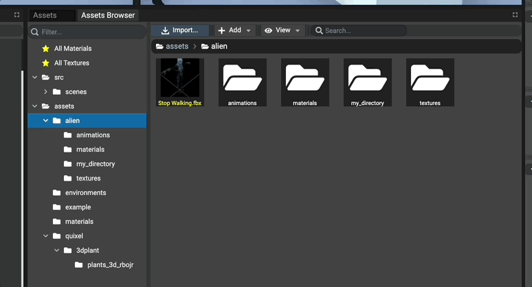
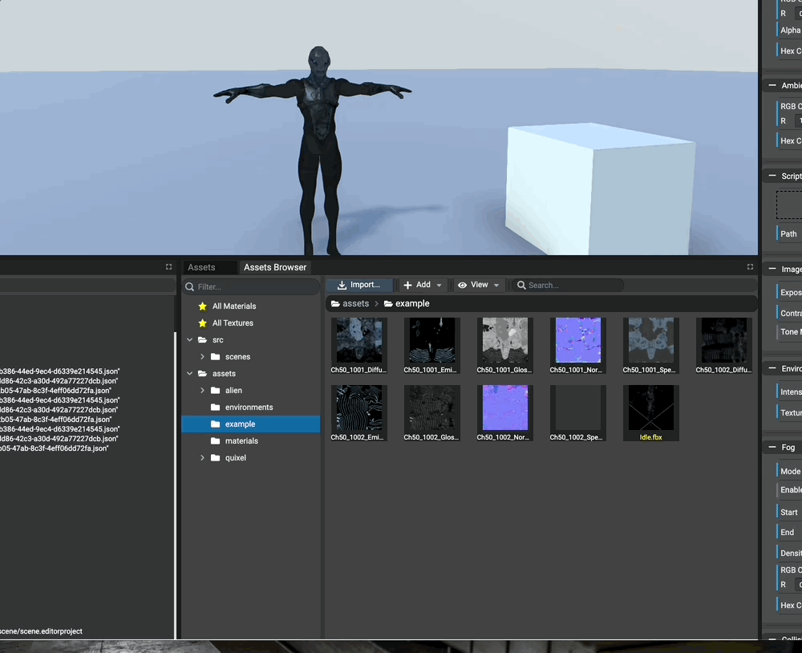
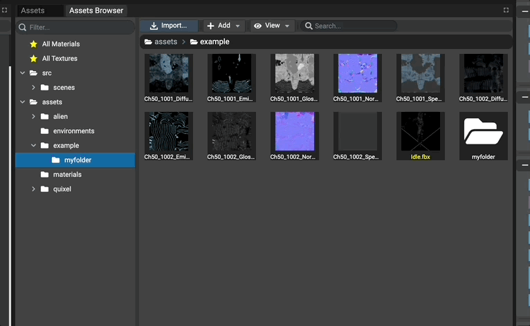
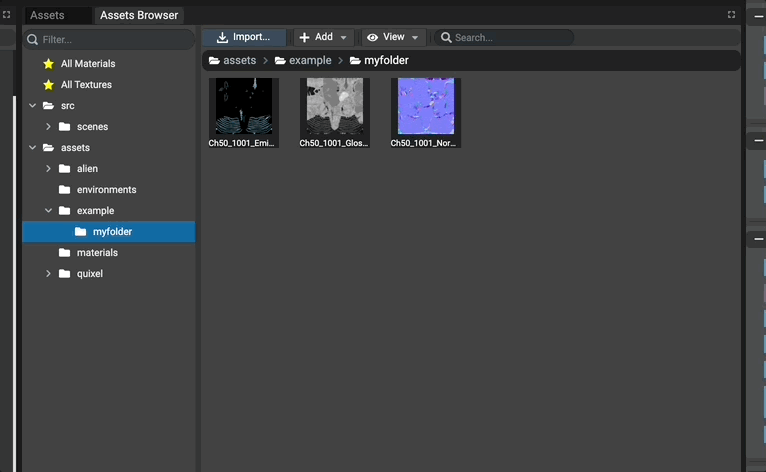

# Introduction

Starting from Babylon.JS Editor v4.1.0, assets management has been improved by introducing a new panel: **"Assets Browser"**.
All assets are now shared across projects and are now browsable like we can do in other famous 3D editors.

The assets browser can browse two main assets types:
* Sources folder `/src` which contains all the project's TypeScript, Json, etc. files
* Assets folder `/assets` which contains all the scenes assets (textures, meshes, materials, sounds, etc.).

To identify assets quickly, distinct colors are applied on titles:
* `Yellow` represents meshes assets
* `Green` represents materials assets
* `Blue` represents particle systems assets

## Using Assets Browser

The Assets Browser panel is composed of 2 resizable panes:
* left pane: the directory tree, like we have in any file explorer
* right pane: the content of the selected directory (files & sub-directories)

Each time a directory is selected in the tree (left pane), the right pane is updated to show its content.

The right pane also contains a stack of opened folders. This stack is used to know the currently browsed path
and can be clicked to quickly access a specified directory available in the stack.

## Using favorites

On top of the directory tree, 2 favorites shortcuts are available:
* `All Materials`: shows the list of all available materials assets that have been instantiated (used) in the current scene.
* `All Textures`: as for materials, shows the list of all available textures assets that have been instantiated (used) in the current scene.

## Creating A New Folder

New folders can be created at any time. Just right-click empty space in the panel, select `New Directory...` and
type the name of the folder to created. Once accepted, a new folder will be created in the currently browsed folder.

## Selecting Files

As any other file browser, multiple files can be selected using either:
- `CTRL or Command + Click` to select multiple individual files
- `Shift + Click` to select a range of files

**Note: rectangle selection is not yet available and is still WIP.**

## Moving Files

Once file(s) have been selected, they can be drag'n'dropped in any folder. Once moved, all links to the moved files
are updated automatically by the editor (materials, textures, sounds, etc.).

Until the project is saved, the editor creates a temporary file named `links.json` located at `${workspacePath}/projects/links.json`.
This json file stores the last moving actions for each moved file in order to, if the project has been closed before saving, retrieve the real path for linked assets (like materials textures).

Drag'n'drop is also supported in the tree

