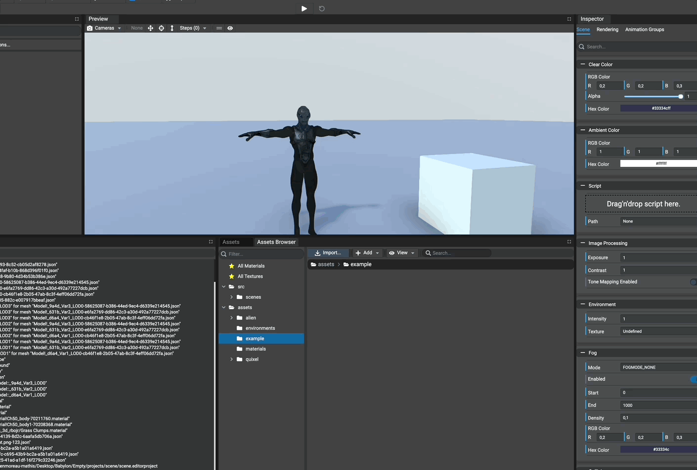

# Adding Files

To add files, simply browse the desired folder and click the button `Import...` in the Assets Browser toolbar.
A dialog will open to select the files to add. Once selected and validated, all the selected assets will be copied to
the currently browsed folder.

Each time a file has been added, its thumbnail will be computed if its type is recognized and supported.

### Supported meshes formats
* .babylon
* .fbx
* .gltf
* .glb
* .obj
* .stl

### Supported texture formats
* .png
* .jpg
* .bmp
* .basis
* .dds (cube texture)
* .env (cube texture)

### Supported sound formats
* .mp3
* .ogg
* .wav

