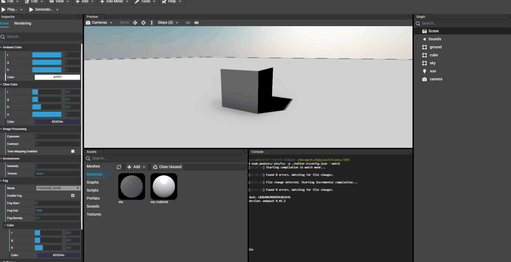
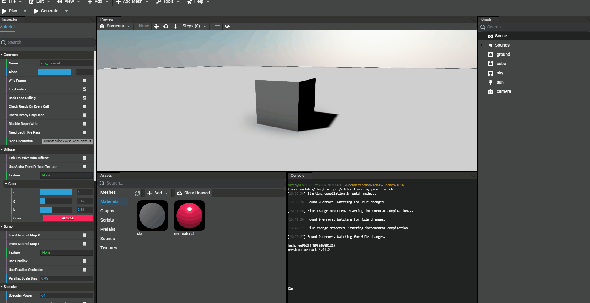
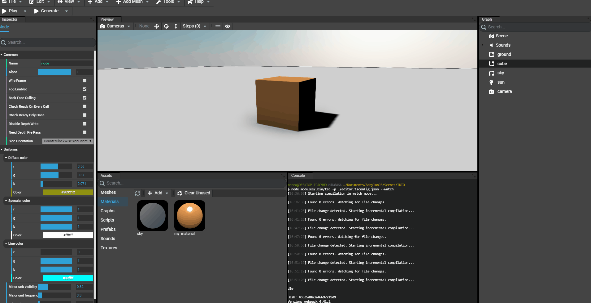
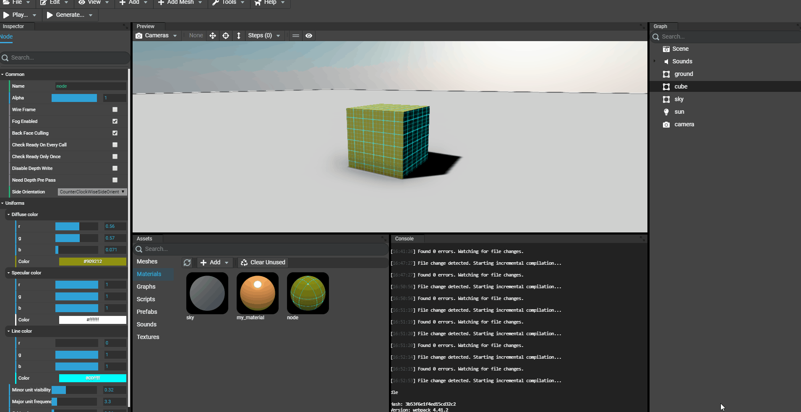
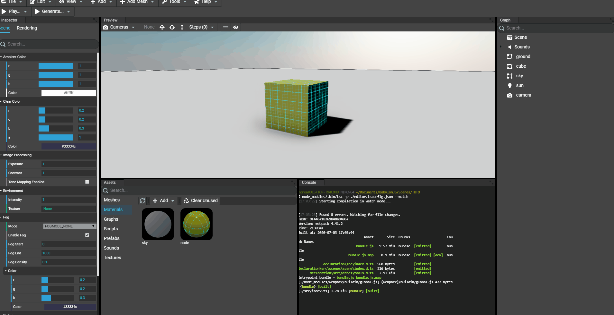

# Adding Materials

## Adding a new material
Using the `Assets` panel of the Editor, there are multiple tabs available. In these tabs, the `Materials` tab will allow to manage materials of the scene:
* Add a standard material (`StandardMaterial` of Babylon.JS)
* Add a PBR material (`PBRMaterial` of Babylon.JS)
* Add a node material (`NodeMaterial` of Babylon.JS)
* Add a node material from a preset (`NodeMaterial` of Babylon.JS)
* Load an existing preset (previously saved)

To add a new material, simply click the button `Add` in the toolbar of the assets panel and select the type of material to create and give it a name. Then, press enter to validate the name.

For example a standard material:

## Examining a material
As for meshes, the assets can be `double clicked`. A new window will open with the Babylon.JS Inspector focus by default on the material.

## Editing a material
To edit a material, just `click` the asset and the inspector of the Editor will be updated with the material's properties. Just edit the properties and changes will occur on all meshes that have the material assigned in the scene, including the preview of the material in the assets panel:

For example, editing the diffuse color:

## Assigning the material to a mesh
To assign a material to a mesh, simply drag'n'drop the asset on a mesh in the scene. Once assigned, the inspector of the Editor will now show a tab named "Material" when we select the mesh that has the material assigned. The material can now be edited event if the selected object is the mesh itself.

**note: When editing a material, the result will be rendered in realtime in the preview but will be deferred in the assets panel.**

## Adding a node material from a snippet id
Since the `NodeMaterial` material of Babylon.JS exists, artists and developers can share their creations using the Node Material Editor: [https://nme.babylonjs.com](https://nme.babylonjs.com/). To share their creations they can save the node materials they created on a server and share directly the link that contains the Id of the snippet. For example: [https://nme.babylonjs.com/#I4DJ9Z](https://nme.babylonjs.com/#I4DJ9Z).

In the Editor, we can load these snippets directly by providing the Id of the snippet to add. It'll then load the material's configuration and copy it locally:

## Saving a material preset
To save a material preset (material that will be typically reused in multiple projects), just `right click` the material in the assets panel and select `Save Material Preset...`.

A preset is a ZIP file that contains the material's properties and its textures files. Once saved, we'll be able to add this configured material in another project:

### Saving preset

### Loading from a preset

