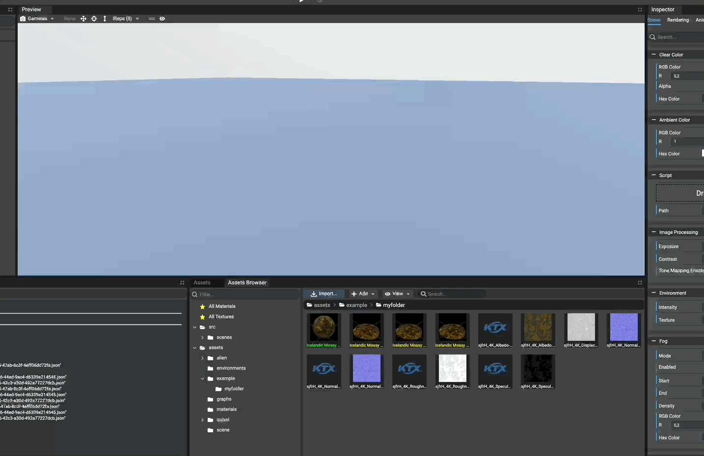

# Adding Meshes

## Adding Meshes To The Scene

To add a new mesh (or hierarchy of meshes, depends on the nature of the source file) to the scene, simply
drag and drop the source file on the preview panel. The mesh(es) will be added where the source file has been
dropped.

When adding meshes to the scene, all skeletons, geometries and materials will be loaded and instantiated in the scene.

Because materials are packed into source files, for each material that doesn't already exist in the assets will be
created as `.material` file(s).

## Updating Existing Meshes

Meshes can be updated even if they were created using an old version of their source files.
Once a source mesh file (.babylon, .fbx, etc.) has been updated in the assets, `right-click the mesh file` and
select `"Update References"`

Meshes can be updated by:
* Choosing which component to update (geometry, material, skeleton)
* Forcing to update all components (geometry(ies), material(s) and skeleton(s))

## Examining Meshes

At any time, `double-clicking a mesh file` in the assets browser creates a new window (or tabbed window on MacOS)
to examine a mesh(es) source file.

Once loaded, the Babylon.JS Inspector appears to inspector the mesh(es) available in the source file.
You can refer to [the inspector documentation](https://doc.babylonjs.com/toolsAndResources/tools/inspector]) to understand how to use the Babylon.JS Inspector.

