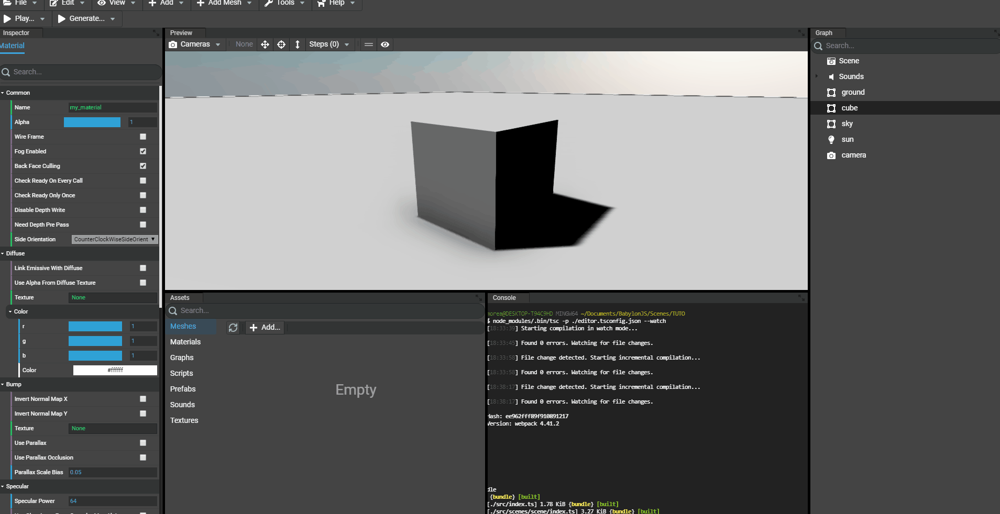

# Adding Textures
As any other scene Editor, to workflow is:
* Add new assets to the project
* Use assets in the current scene
* Edit instantiated assets

Supported file types:
* .png
* .jpg
* .dds (cube texture)
* .env (cube texture)

## Adding assets to the project
As for meshes, textures can be added by browsing files and drag'n'dopping files. In the assets panel, a tab named `Textures` contains the list of all available textures in the scene.

### Browsing for files
Simply go to the "Assets" panel of the Editor and click "Add...". A dialog opens to select the files:

### Drag'n'dropping files

## Examining the asset
As for meshes and materials, a texture can be examined. On an assets is `double clicked` a window appears showing the texture. For cube textures (.dds or .env files) the sphere is created having the texture mapped on with the Babylon.JS Inspector opened and focused on the cube texture.

## Assiging textures to material
Once all required textures have been added to the project's assets. We can now assign textures to materials.

Each type of material will have its own inspector in the Editor in order to provide properties to edit in order of importance.
Just select a material in the assets panel or a mesh in the scene that has a material and start editing the material's properties.

In some cases, textures must be edited as well. Typically, for a large terrain, the scale of the texture must be edited in order to set the new scale on (U,V) and adapt the texture's size. To edit a texture, simply select it in the assets panel and the inspector will be updated to show the texture's properties.

For example, a standard material applied to the ground, we apply the `amiga.jpg` texture as the diffuse texture:

## Cloning a texture
In some cases, the same texture is needed but with distinct properties. For example, our texture `amiga.jpg` should be available with a UV scale of (30, 30) to be applied on the ground, but also with a UV scale of (1, 1) to be applied to the cube.

To clone a texture, just go the assets panel of the Editor and `right click` the desired texture. A context menu appears and select `Clone...`.
A dialog appears to ask the name of the new texture. Once done, a new texture has been created that shares the same texture file (`amiga.jpg`).

As the texture is a clone, all properties are the exact same as the original texture. Just edit the desired properties.

Example with the cube:

