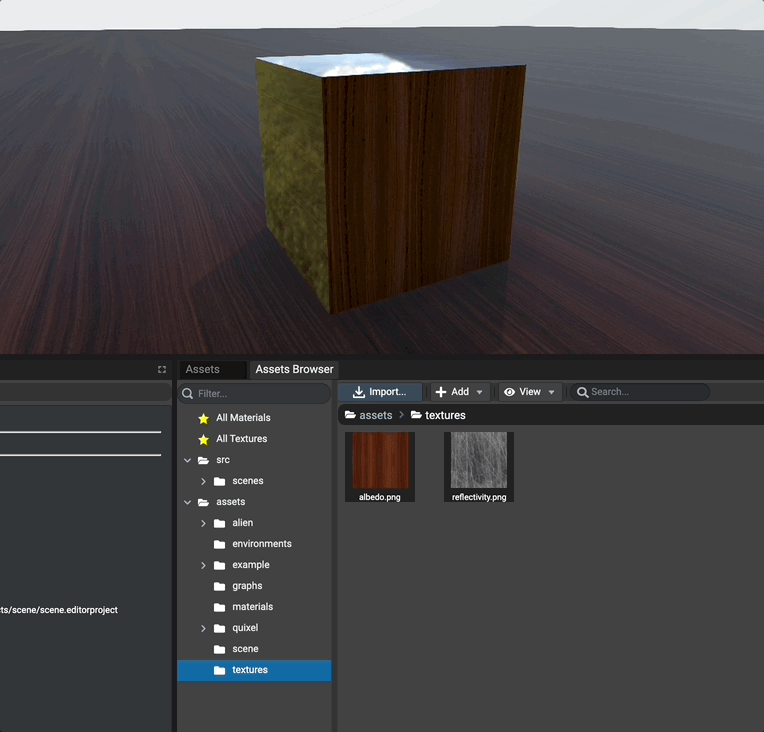
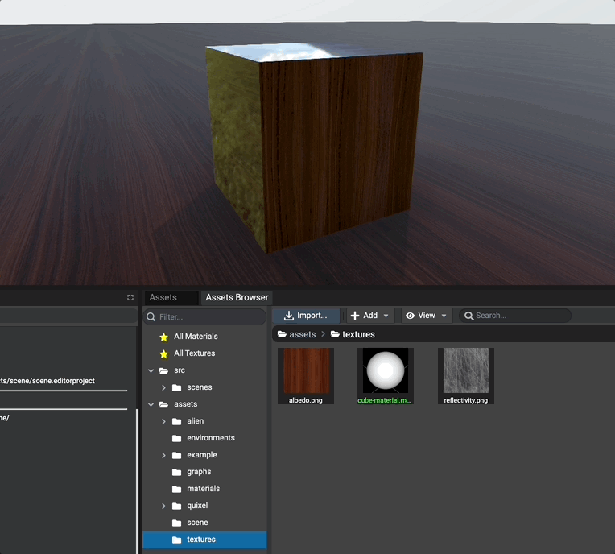
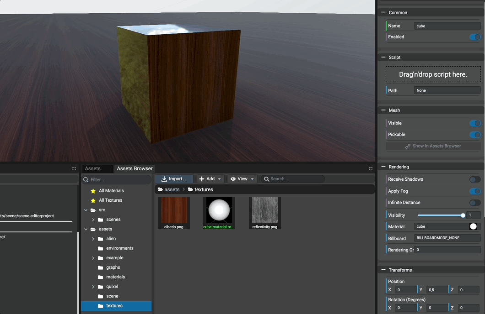
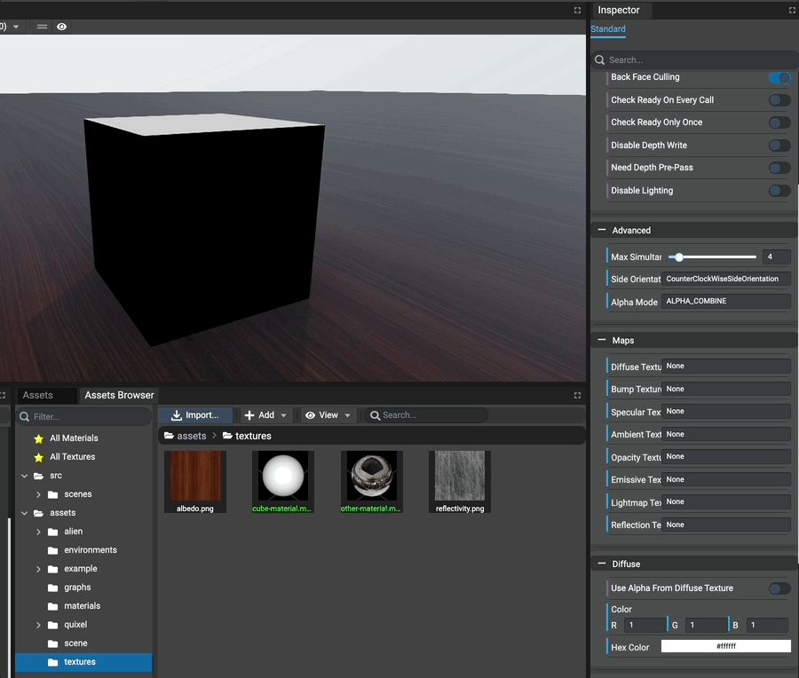
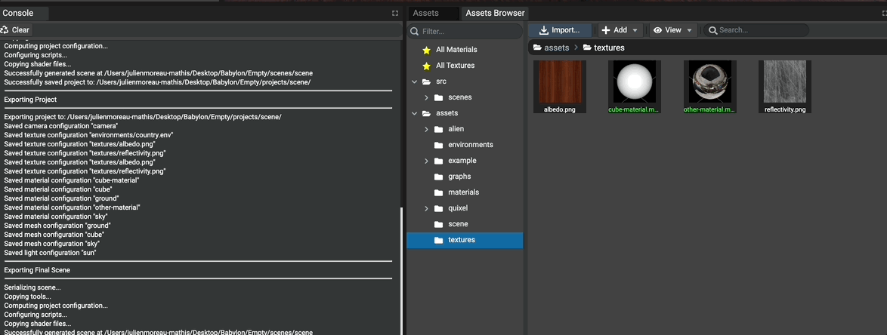

# Adding Materials

## Introduction

Materials are considered to be assets and are available in the `Assets Browser` panel once they are created.

To create a material, use the assets browser panel toolbar `Add -> Materials -> ...`.

Common materials `Standard`, `PBR`and `Node` are supported as well as most of the available materials from
the [Materials Library](https://doc.babylonjs.com/toolsAndResources/assetLibraries/materialsLibrary).
Once a material has been added to the assets, its preview (thumbnail) is created automatically.

## Assigning A Material

To assign a material to a mesh, simply drag'n'drop the material asset from the assets browser on the mesh in
the preview panel or in the inspector.

Once a material asset has been dropped, if the material hasn't been previously instantiated the editor will
create its instance automatically. If the material has been already instantiated, the existing reference is used
to be assigned on the mesh.

Example drag'n'dropping a material asset on a mesh in the `Preview Panel`:

Example selecting a mesh in the graph or the scene and drag'n'dropping a material asset in
the inspector's field `Material`:

## Editing A Material

To edit a material, simply click on the material in the `Assets Browser` panel or `Assets` panel.
Once clicked, the inspector is updated to show the editable properties of the material.

If the material has not been instantiated, assign the material first on a mesh. Else, the inspector will not be instantiated because the instance of the material can't be found.

## Refreshing Thumbnail

To save performances in Editor, materials thumbnails are not permanently updated. In case, for example, one or
multipe texture asset have been changed, the thumbnail will not be necessary updated.

To update the thumbnail of materials, simply select the materials in the assets browser, `right-click` them
and select `Refresh Preview`.

