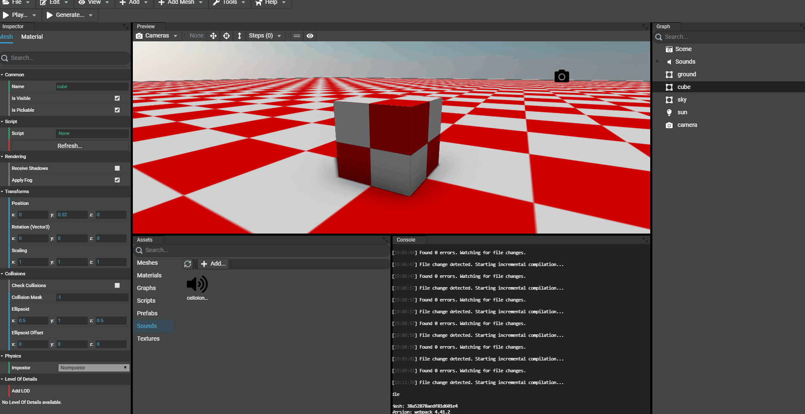

# Adding Sounds
As for meshes, textures and materials, sounds can be added to the project's assets.

Supported file types:
* .mp3
* .wav

## Adding assets to the project
Sounds can be added by browsing files and drag'n'dopping files. In the assets panel, a tab named `Sounds` contains the list of all available sounds in the scene.

### Browsing for files
Simply go to the "Assets" panel of the Editor and click "Add...". A dialog opens to select the files:

### Drag'n'dropping files

## Editing a sound
To edit a sound, just go to the assets panel of the Editor and select the sound to edit. The inspector of the editor will be updated showing the sound's properties.

## Adding a spatialized sound
By default, all sounds added to the scene are not spatialized. To set a sound spatialized, just drag'n'drop the sound asset on a node in the scene. Once done, the sound is now attached to the node (Mesh or Transform Node).

The inspector of the editor contains a new section which is focusing on the spatialized properties.

