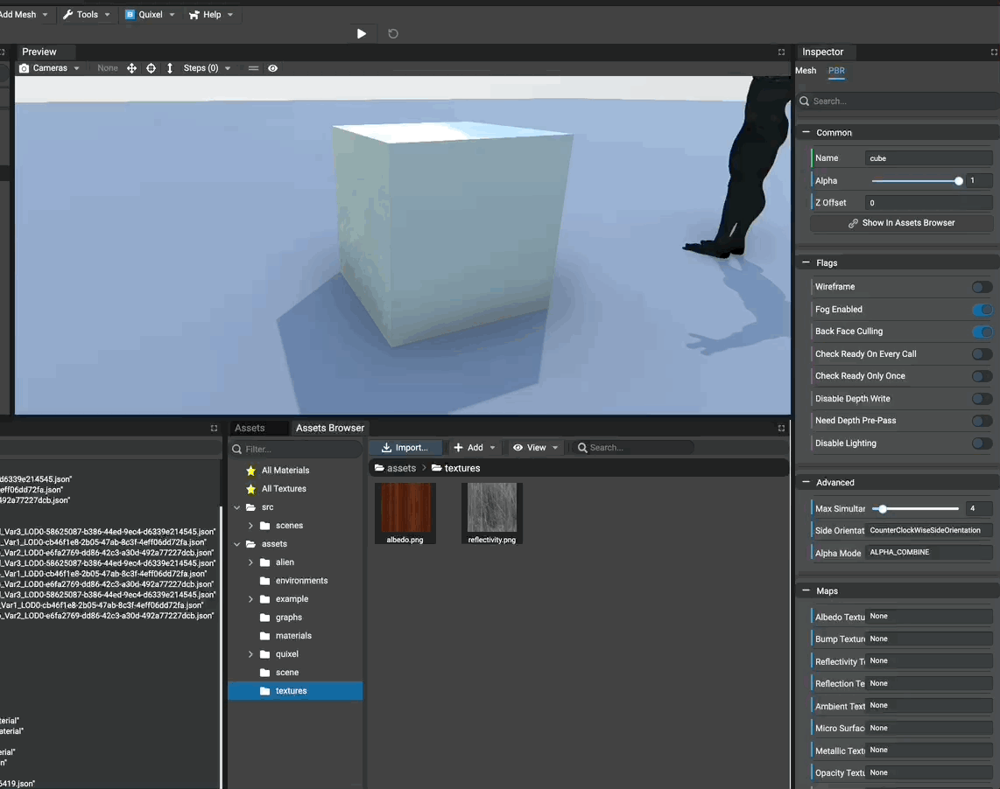
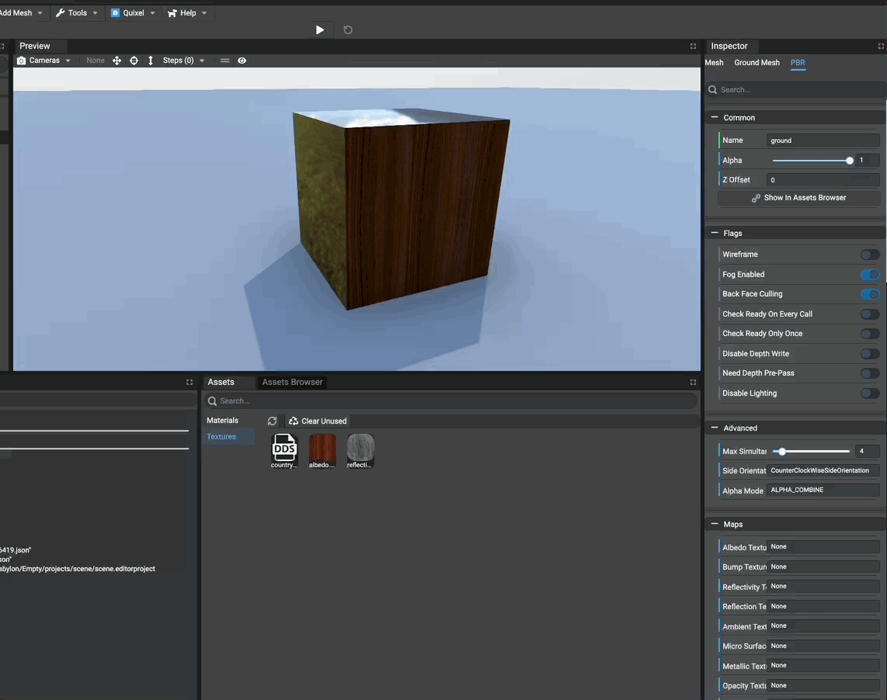
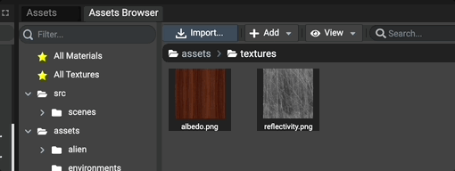

# Using Textures

## Applying Textures On Materials

Textures available in assets browser can be used and applied on materials.
By default, textures available in assets browser are not instantiated in scene.

In order to instantiate textures in the scene and use them on materials, simply drag'n'drop the texture assets
in the inspector on list boxes.

In the inspector, all list boxes related to textures (for example "Environment Texture" in scene inspector) support
drag'n'drop from assets browser.

## Cloning Textures

Multiple instances of a same texture file can be created using the `Assets` panel.

Once a texture has been instantiated, it appears in the assets panel. Simply right-click the texture and select
`Clone...`. Enter the name of texture instance to create and finally a new instance sharing the same texture file
is created and available in the assets panel.

As for the assets browser panel, textures from the assets panel can be drag'n'dopped.

## Editing A Texture

To edit a texture, simply click on it in the `Assets Browser` panel or `Assets` panel.
Once a texture has been clicked, the inspector is updated to show the editable properties of the clicked texture.

In the assets browser, if a texture file has multiple instances, a menu appears to select the texture instance
to edit in the inspector.

