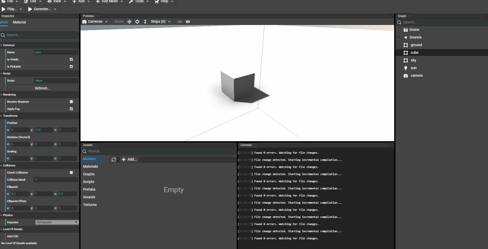
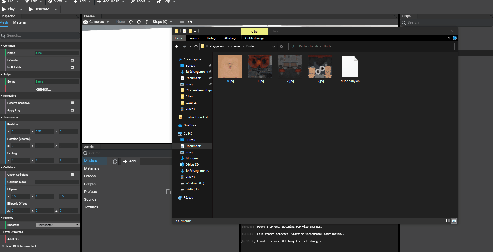
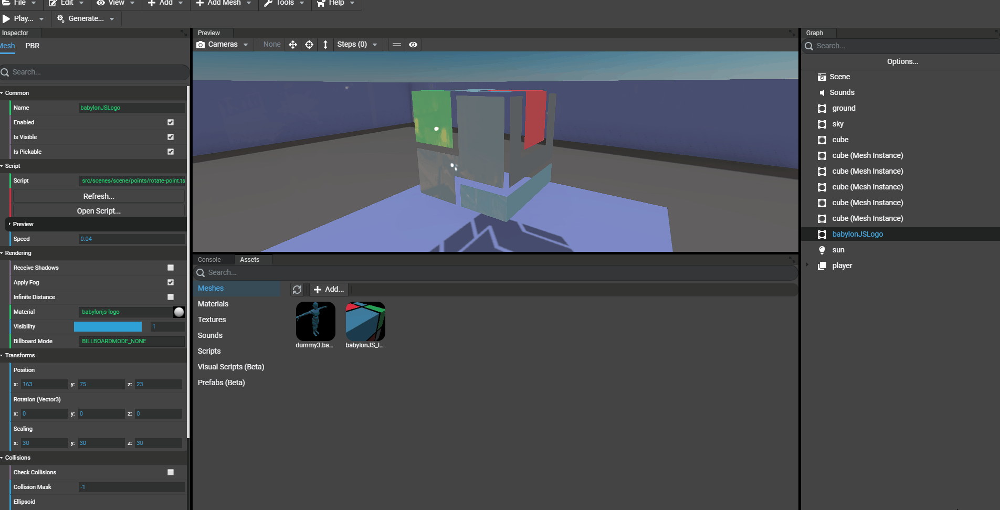
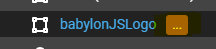
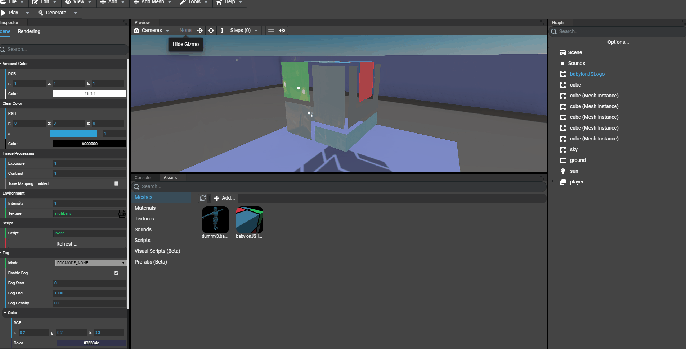

# Adding Meshes

As any other scene Editor, to workflow is:
* Add new assets to the project
* Add asset to the current scene (here, meshes)
* Edit instantiated assets

## Supported meshes formats
The Editor supports the 3 common formats:
* .babylon
* .gltf
* .glb

## Adding assets to the project
There are 2 ways to add meshes assets to the current project: browse for files or drag'n'drop files in the assets panel of the Editor.
In both ways, take care to select/drag'n'drop all needed files for the meshes.

### Browsing for files
Simply go to the "Assets" panel of the Editor and click "Add...". A dialog opens to select the files:

### Drag'n'dropping files

## Examining the asset
Once the asset has been added to the project, we can examine the asset's file by `double clicking` on it. This will open a new window and open the `Inspector` of Babylon.JS with the asset rendered.

You can refer to [the inspector documentation](https://doc.babylonjs.com/features/playground_debuglayer]) to understand how to use the Babylon.JS Inspector.

## Adding meshes to the scene
To add meshes to the scene, simply drag'n'drop the asset to the preview of the Editor. This will add the meshes contained in the asset with their materials/textures to the scene.
Once added, you can select elements in the graph and edit them using the Inspector of the Editor.

## Updating instantiated meshes
Once meshes have be added the the scene (instantiated), there are 2 ways to upate them:
- Remove the instantiated meshes and re-add them like seen above
- Use the Editor's built-in helpers to automatically update their properties. The updatable properties are:
  - Update geometries
  - Update materials (if the mesh uses a material in the source file)
  - Update skeletons (if the mesh is animated by a skeleton)

Using the built-in helpers, there are 2 ways to update instantiated meshes:
- Force update **ALL** instantiated meshes in the scene
- Prepare update and let the user select which meshes will be updated

In both ways, the built-in update will:
- Store (or force update) the new geometry, material and skeleton objects for each instantiated mesh
- Create the missing objects if the source file comes with new objects not already instantiated in the scene

### Forcing update of all instantiated meshes
To force updating all instantiated meshes, just `right-click` on the desired mesh asset in the `assets panel` and select `"Force Update Instantiated References..."`.

In the following example, the Babylon.JS logo has a custom PBR material but we'd like to update its material from the source file:

### Letting the user updating the meshes
As for the forced mode, just `right-click` on the desired asset in the `assets panel` and select `"Update Instantiated Meshes..."`. Once applied, the graph will be updated with a `"..."` icon telling the user that the object is waiting for an update:

Clikcing on the update icon will show a context menu of all available updates:
- Update Geometry
- Update Material (if a material is set in the original source file)
- Update Skeleton (if the mesh is animated by a skeleton)

It is now free to update all components or only the wanted components. For example, it can be useful to update only geometry and keep the material created in the Editor:

### Cleaning assets
In order to let the user managing its own assets, the Editor will never remove useless assets until it is asked by the user. That means, when updating meshes, that old materials and texture will still be availalbe in the assets panel. Don't forget to clear unused assets (for example unused materials then unused textures) to keep the project clear if you are sure that old materials, for example, are not needed anymore.
