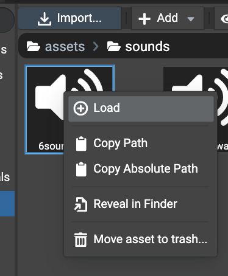
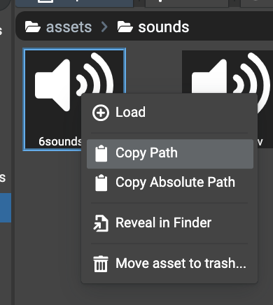

# Getting Components

## Introduction

Getting references to components in scene can be done directly by decorating properties. The api provided by the editor
resolves the references automatically. This allows to get components references directly when declaring properties
and avoids to use functions such as `scene.getMeshByName(...)` etc.

## Available decorators

### From Children

To get the reference to a child of the current node having the script attached, properties in a script class can
be decorated using the `@fromChildren` decorator. The parameter of the decorator is the name of the child to get.

```typescript
@fromChildren("light")
private _light: PointLight;
```

This parameter is optional. If it is undefined, the name of the property is used. For example:

```typescript
@fromChildren()
private _light: PointLight; // the name of the child must be named "_light" in the Editor.
```

### From Scene

Compared to `@fromChildren`, components references can be retrieved by traversing the overall scene using the
`@fromScene` decorator. This decorator works like the `@fromChildren` one where the parameter is the name of the
node to retrieve. The parameter is also optional.

```typescript
import { Mesh } from "@babylonjs/core/Meshes/mesh";
import { DirectionalLight } from "@babylonjs/core/Lights/directionalLight";

import { fromScene } from "../decorators";

export default class MyMeshComponent extends Mesh {
    @fromScene("sun")
    private _sun: DirectionalLight;

    public onStart(): void {
        this._sun.intensity = 10;
    }
}
```

### From Particles Systems

In Babylon.JS, particle systems are not nodes. To retrieve particle systems, neither `@fromChildren` and `@fromScene`
decorators can be used. To retrieve particle systems, there is a specialized decorator named `@fromParticleSystems`.

As for other `@from{X}` decorators, the parameter of this decorator is the name of the particle system. If not provided,
the name of the property is used.

```typescript
import { Mesh } from "@babylonjs/core/Meshes/mesh";
import { ParticleSystem } from "@babylonjs/core/Particles/particleSystem";

import { fromParticleSystems } from "../decorators";

export default class MyMeshComponent extends Mesh {
    @fromParticleSystems("rain")
    private _rain: ParticleSystem;

    public onStart(): void {
        this._rain.start();
    }
}
```

### From Animation Groups

As for particle systems, animation groups are not nodes. To retrieve a reference to an animation group, simply decorate
the property using the `@fromAnimationGroups` decorator.

The parameter of this decorator is the name of the animation group. If not provided, the name of the property is used.

```typescript
import { Mesh } from "@babylonjs/core/Meshes/mesh";
import { AnimationGroup } from "@babylonjs/core/Animations/animationGroup";

import { fromAnimationGroups } from "../decorators";

export default class MyMeshComponent extends Mesh {
    @fromAnimationGroups("walk")
    private _walk: AnimationGroup;

    public onStart(): void {
        this._walk.play(true);
    }
}
```

### From Sounds

As for animation groups, sounds are not nodes. To retrieve a reference to a sound, simply decorate the property using
the `@fromSounds` decorator.

In order to retrieve the reference, the sound must be loaded in the project either attached to a node (spatialized)
or loaded as 2D sound.



The parameter of this decorator is the name of the sound. In Babylon.JS, the name of a sound is its path provided
when the sound is being loaded. For example `assets/sounds/mySound.mp3`.

To get the name of a sound, the `Assets Browser` panel provides a helper by `right-clicking` the sound file. Simply
click on `Copy Path` in the context menu so the name of the sound is added to the clipboard and just paste it
in code editor on the parameter.



Example:

```typescript
import { Mesh } from "@babylonjs/core/Meshes/mesh";
import { Sound } from "@babylonjs/core/Audio/sound";

import { fromSounds } from "../decorators";

export default class MyMeshComponent extends Mesh {
    @fromSounds("sounds/6sounds.mp3")
    private _sound: Sound;

    public onStart(): void {
        this._sound.play();
    }
}
```
