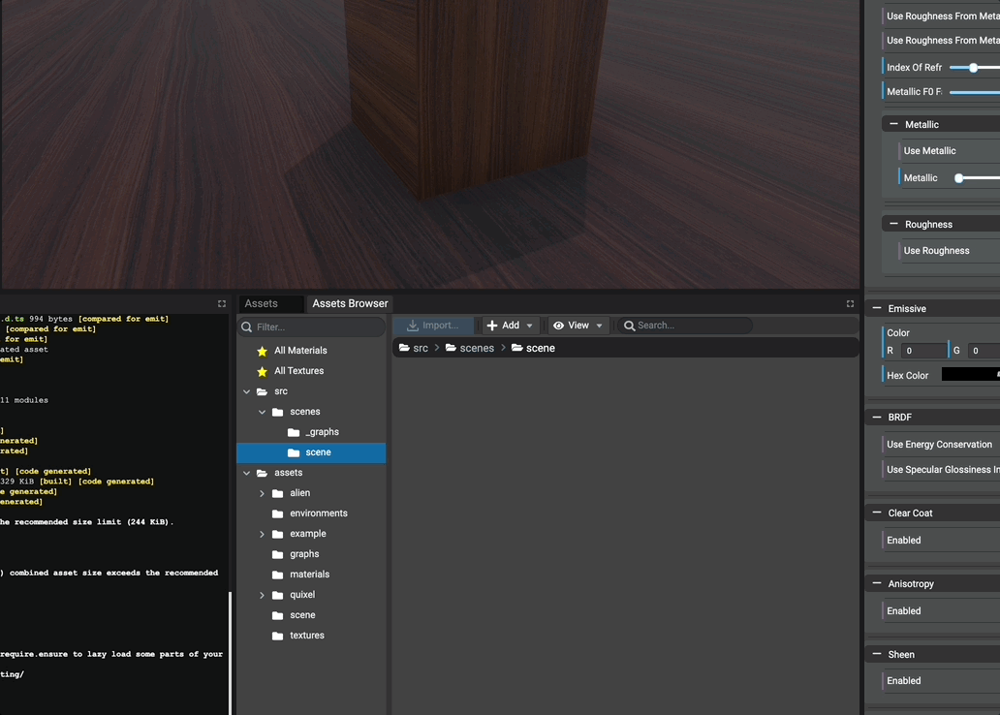
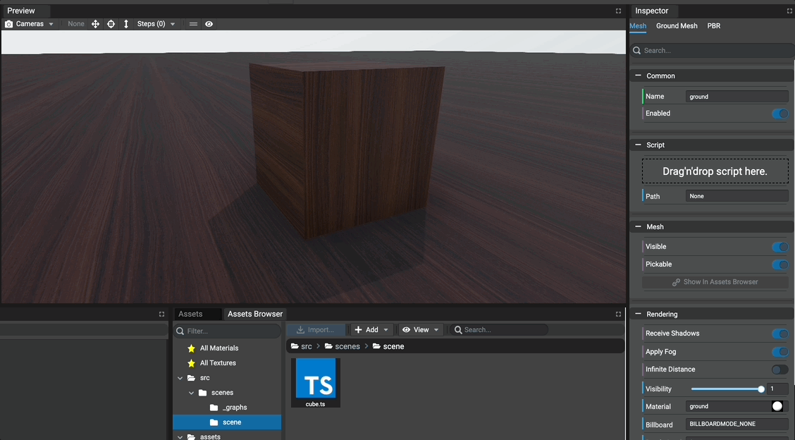
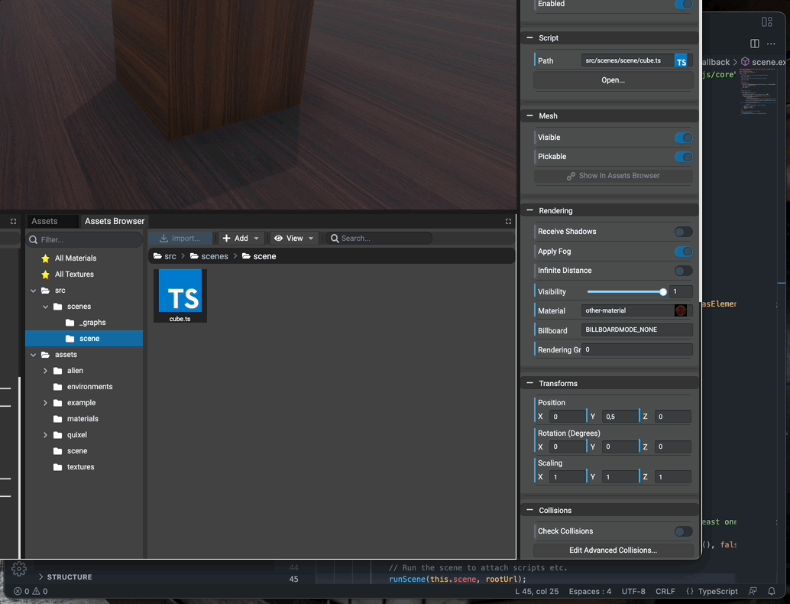
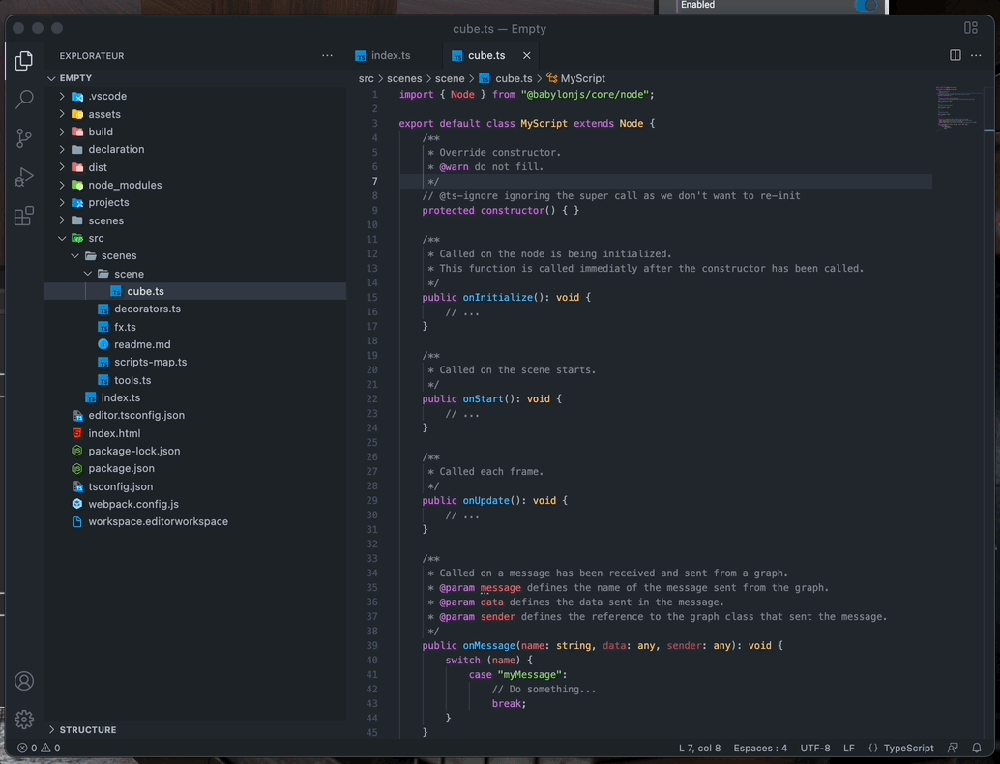
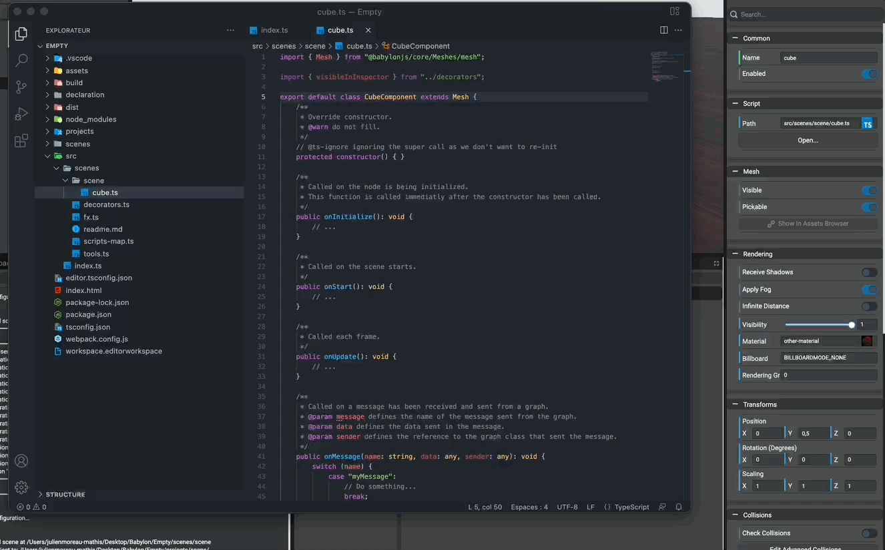
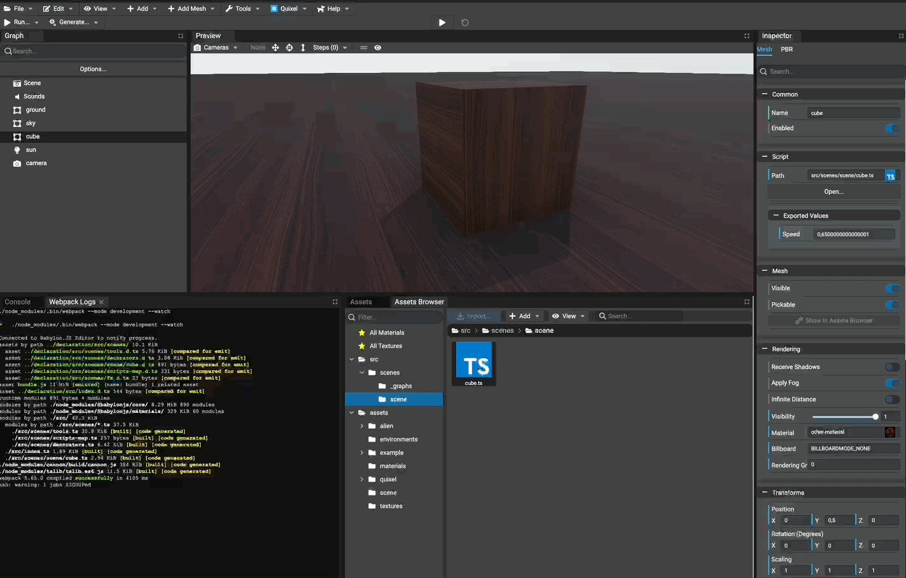

# Attaching Scripts

## Introduction

The Editor allows to create and edit scenes without any line of code. Anyway, each object in scene can be customized by adding behaviors that developers can create using TypeScript. These behaviors can be attached to objects and will wake up when the game is running.

As examples, a behavior can be:
* I have a camera and I'd like to launch a ball when I click, according to the camera's direction
* I have an object and I want it to scale up when the mouse is over
* etc. etc.

The Editor provides a way to create, manage and attach these scripts to all available objects in the scene. To customize scripts, the scripts can export properties (numbers, strings, booleans, vectors, keys, etc.) and these properties will be editable directly in the Editor.

Scripts can be attached to:
* Mesh
* Mesh Instance
* Light
* Camera
* Transform Node

**Note: all scripts are written using TypeScript**

**Note: the Editor is optimized to work with Visual Studio Code**

## Adding a new script

Once a workspace has been created, in the `Assets Browser` panel tree, a folder named `src` is available and browses all the available scripts in the project starting from the `src` folder.

In the assets browser panel, just browse the `src` folder click `Add -> TypeScript File...` and give it a name. Once done, a script has been created from a template and is now ready to be attached.

**Note: when no extension provided, the `.ts` extension is automatically added.**



## Attaching a script

We named our script `cube.ts` and it'll be attached to the cube in our scene for this tutorial. To attach a script, just select the cube and go to the `Script` section in the Editor's inspector. We can now select the script to attach, let's select `cube.ts`.

**Note: The inspector also supports drag'n'dropping a script asset.**

**Note: only one script can be attached to an object but one script can be attached to multiple objects in the scene.**



## Opening the project in VSCode and focus on the script
To help locating the project and scripts in our workspace, we can open `Visual Studio Code` directly from the Editor. Also, the Editor can open scripts directly.

* To open `Visual Studio Code`, just select `File -> Open Visual Studio Code` in the toolbar.
* To open a script, simply `double-click` the desired script in the assets browser panel.



## Understanding scripts

Scripts are used to specialize an object. That means it'll be attached to an existing object in the scene (for example a mesh here). Each script will be notified:
* when it starts: means when all assets are loaded and game is ready. This is the function named `onStart` in the script.
* each frame: each time Babylon.JS renders a frame, the script is called immediately just before the frame is rendered? This is the function named `onUpdate` in the script.

By default, a script is named `MyScript` and it can be renamed. Also, a script extends, by default, the class `Node` of Babylon.JS. Here, we attached the script to a cube, which is a mesh. Let's extend `Mesh` instead of `Node` so we'll have auto-completion for `Mesh` when typing `this`:



## Customizing scripts in editor

Scripts can be customized directly in the editor by setting custom properties. Available property types are:
* number
* string
* boolean
* vector (2d, 3d and 4d)
* key map

To set a property visible in the Editor, just decorate it `@visibleInInspector` in the script. More informations about decorators here: https://www.typescriptlang.org/docs/handbook/decorators.html#decorators

**These decorators are availalbe in the file `src/scenes/decorators.ts`. Decorators in `src/scenes/tools.ts` are deprecated since v4.0.0-rc.2 and will be definitely removed in v4.1.0 version.**

The `@visibleInInspector` decorator has the given arguments:
* the property type (number, string, boolean, etc.)
* the name of the property to be shown in the Editor
* the default value of the property

On the property is decorated and the script saved, the inspector is updated automatically and shows the newly
decorated property.



## Rotating the cube using the attached script

All TypeScript files are packed using, by default, WebPack, including the scripts that are attached to objects. That means we have to watch (or build) the project to see the effect when running the game.

There are 2 ways to watch the project:
* Watch automatically with the Editor
* Watch using a command line that runs a script available in the package.json file or the project.

As a developer, using the command line, simply open a terminal at the root folder of the workspace and type:
```bash
npm run watch
```

This will watch ALL the TypeScript files and repack the dist files.

Using the editor, simply open the preferences, go to the `Workspace` section and enable the automatic watch
(if not enabled):



Now, let's rotate the cube using our customized property `_speed` and run the game. In this tutorial, the `onStart` function is not used. When one of these functions is not used, it can be removed.

Once the scene is being played, each decorated property supports live update. In other words, each time a
decorated property value is modified in the inspector, the linked element in the scene being played has its
decorated property updated.


## Managing scripts

It is **important** that managing scripts must be done using the `Assets Browser` panel:
- Moving
- Removing
- Renaming

Doing this in the Editor allows to automatically re-configure objects that have the attached scripts. For example, 
when moving a script all paths will be updated internally.

**Note: once a script has been moved etc. don't forget to update relative imports in the script to suppress compilation errors.**
