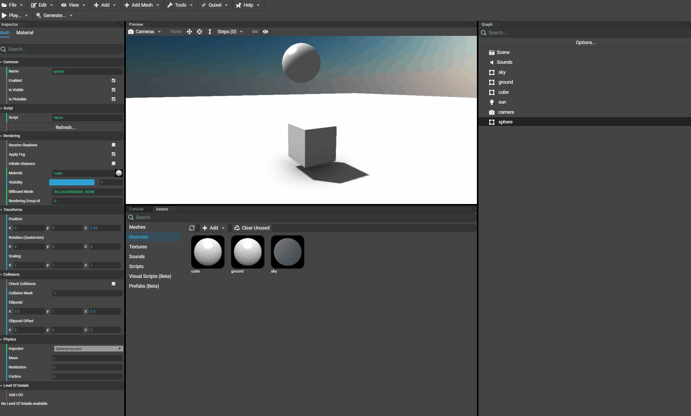

# Using Physics

## Introduction
The Editor allows to setup and edit physics impostors for meshes in the scene using the inspector. All physics engines are supported:
* `CannonJS`
* `OimoJS`
* `AmmoJS`

By default, physics is enabled in the project and is using `CannonJS`.

## Setting up physics
By selecting a mesh or mesh instance (basically any object extending `AbstractMesh`) in the scene, the inspector will be updated to show the object's properties. For meshes and meshes instances, some properties are focusing on physics located in the folder named `Physics`. By default, all unconfigured meshes have no impostor (`NoImpostor`).

At the moment, the available impostors are:
* `BoxImpostor`
* `SphereImpostor`
* `CylinderImpostor`

By selecting a new impostor, the tool will be updated to show the common properties which are:
* `Mass`
* `Restitution`
* `Friction`

A documentation for all these options is [available here](https://doc.babylonjs.com/divingDeeper/physics/usingPhysicsEngine#options).

Once these properties are configured, the physics is not preview-able in the Editor. To preview the result, just run the project to see the physics effect and adjust the properties if needed by clicking on the button `Play` in the tools toolbar.

In the following example, the box and ground already have an impostor set to `BoxImpostor` where the box has a mass of 1 and the ground has a mass of 0 (to stay static).


## Changing gravity
When selecting the scene in the scene graph, there are 2 editable gravity properties:
* Collisions gravity
* Physics gravity

According to the wanted effect, both gravity values can be distinct. In the `Physics` folder of the scene inspector the gravity applied by the physics engine can be customized:



## Choosing physics engine
Using the inspector, the scene's properties allow to change the physics engine that should be used by the project. By default, `CannonJS` is used and can be replaced by OimoJS and AmmoJS. Changing the physics engine can be done without having to reset or redefine the impostors already existing.


Once desired physics engine is selected, the project must be updated as well. In fact, by default the project templates are using `CannonJS` where the library is imported in the `index.html` file. In case of using `OimoJS` for example, this import must be replaced by the one that imports `OimoJS`. The default template looks like:

```html
<!DOCTYPE html>
<html xmlns="http://www.w3.org/1999/xhtml">

    <head>
        <meta http-equiv="Content-Type" content="text/html; charset=utf-8" />
        <title>Babylon.js Generated Template</title>

        <!-- Loads the game -->
        <script src="./dist/bundle.js" type="text/javascript"></script>

        <!-- Loads the physics engine "CannonJS" -->
        <script src="./node_modules/cannon/build/cannon.js" type="text/javascript"></script>

        ...
    </head>

    <body>
        ...
    </body>

</html>
```

In other words, for this example, the `CannonJS` import should be replaced to load the file `Oimo.js` from CDN or any other corresponding file in `node_modules`:

```html
<script src="https://cdn.babylonjs.com/Oimo.js" type="text/javascript"></script>
```

Or using `AmmoJS`:

```html
<script src="https://cdn.babylonjs.com/ammo.js" type="text/javascript"></script>
```

Which gives, for example with `AmmoJS`:

```html
<!DOCTYPE html>
<html xmlns="http://www.w3.org/1999/xhtml">

    <head>
        <meta http-equiv="Content-Type" content="text/html; charset=utf-8" />
        <title>Babylon.js Generated Template</title>

        <!-- Loads the game -->
        <script src="./dist/bundle.js" type="text/javascript"></script>

        <!-- Loads the physics engine "AmmoJS" -->
        <script src="https://cdn.babylonjs.com/ammo.js" type="text/javascript"></script>

        ...
    </head>

    <body>
        ...
    </body>

</html>
```
