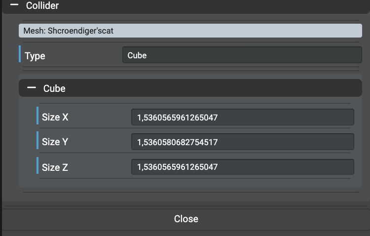
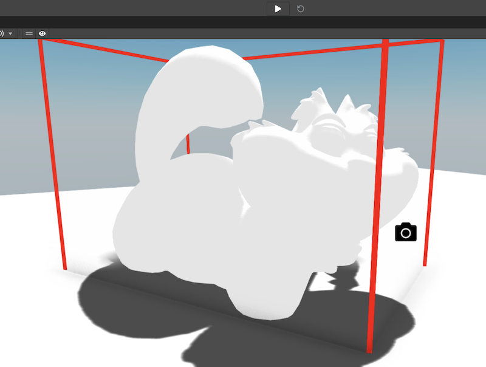
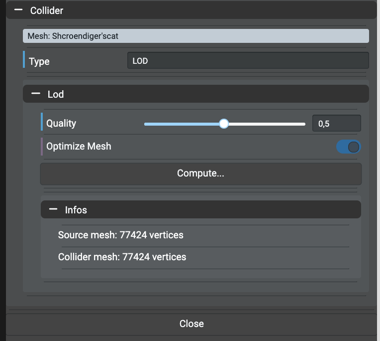
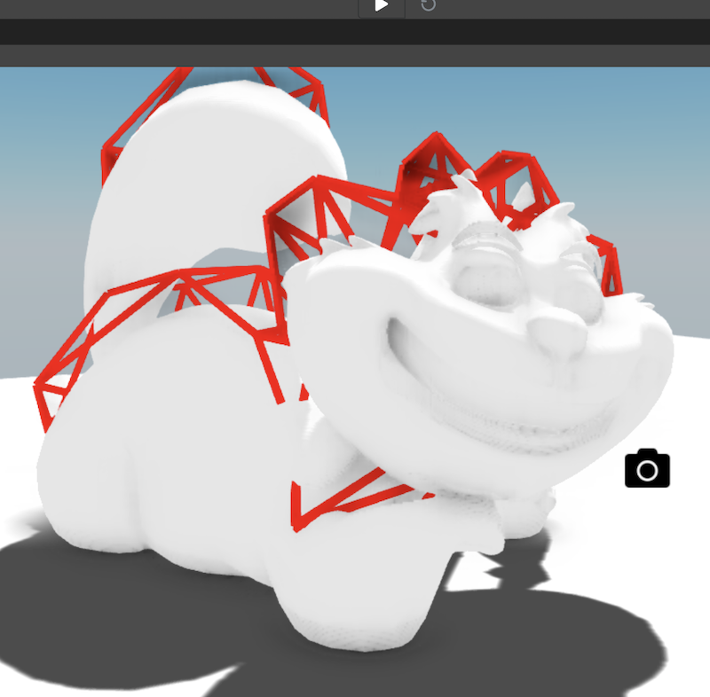

# Setting Advanced Collisions

Checking collisions on complex objects can have a big impact on performances even for cameras and meshes
using the `.moveWithCollisions` method. The editor provides a tool to easily setup collisions shapes on any mesh object in the scene
in order to save performances.

## Introduction
### Basic Collisions
By default, Babylon.JS will check for collisions using a complex algorithm that checks collisions per triangle for each mesh near the cammera
or the mesh being moved with collisions. Sometimes (often), checking collisions on the bounding box is highly sufficient.

The method would consist on:
- Create by code a new cube mesh or sphere mesh (named `collider`)
- Add the collider as a child of the mesh
- Apply the bounding box properties of the mesh to the collider
- Disable collisions on the mesh and enable collisions on the collider.

In that way, the collider will always extend the transform of the mesh and camera will only check collisions on the cube or sphere collider
instead of checking collisions on the entire mesh per triangle.

### Advanced Collisions
Let's image a more complex scenario where box and sphere collisions are not sufficient: **the stairs**. In that case, only "per triangle" collisions will allow to upstair in a natural way.

In case the stairs 3d model is too complex, and in order to save performances, the solution would be to provide
(or generate on the fly) a lower detailed 3d model for the stair.

The method would consis on creating a lower level of details object of the source mesh (instead of a cube or sphere) made by an
artist or using the [Auto-LOD Simplification Tool of Babylon.JS](https://doc.babylonjs.com/divingDeeper/mesh/simplifyingMeshes)
and perform the same next steps for `Basic Collisions`.

The problem here is that generating a lower level of details has a cost in time and simplifying a mesh using the simplification method
is asynchronous.

### Editor To The Rescue
The editor provides a tool to generate these `colliders` per mesh to save time and performances.

## Editing Advanced Collisions
To edit the advanced collisions, select a mesh in the graph, scroll in the inspector to find the `Collisions` section
and click the button `Edit Advanced Collisions...`. On clicked, a new tool is opened over the inspector showing the current
state of the collisions of the object.

## Understanding The Tool
Once opened, the tool shows the current stage of the collisions of the object (here `None`). To selected a collider type,
just open the listbox and selected the desired collider type. Each time a collider type is changed, the mesh's collision component
is updated in the preview and shown in red.

*Note: For meshes that have instances, each time a collider type is changed then all instances are updated to introduce the new collider
component.*

### Cube Collider
The `Cube` collider is the most performant collider that allows to check collisions only on the bounding box of the mesh.

In other words, just imagine that the following model will have collisions check like it was a cube instead of a complex mesh:

### Sphere Collider
As well as the `Cube` collider, the `Sphere` collider will allow to check the collisions on the bounding sphere of the mesh
insteadof the bounding box of the mesh. In some cases, that collider can be useful especially if the moving platform is a sphere.

### LOD Collider
Taking the specific scenario example (the stairs), to tool allows to create an Auto-LOD according to few properties.
It uses the `QuadraticErrorSimplification` implementation in Babylon.JS and allows to pre-generate the lower level of details
that will be saved as well as the rest of the scene. In other words, no extra work is needed.

To understand the properties, check the
[following documentation](https://doc.babylonjs.com/divingDeeper/mesh/simplifyingMeshes#mesh-optimization-startingbabylonjs-21)
for the `Optimize Mesh` property and the
[following documentation](https://doc.babylonjs.com/divingDeeper/mesh/simplifyingMeshes#usage---simplifying-a-mesh)
for the quality property.

As informations, the tool shows the base vertices count vs. the LOD vertices count. This can help to understand how much the mesh
has been simplified. Take care to don't simplify too much in order to keep the overall topology of the mesh in case of, for example,
the stairs.

In most cases, setting the quality as "0.01" works where the vertices count can change from `77 424` to `882`.

Once properties are set, just click the `Compute...` button to generate the LOD and an overlay will appear to notify that the
algoritm is working. Once done, the `Infos` section is updated to show the new vertices count value and the collider mesh in the preview
is updated as well:

