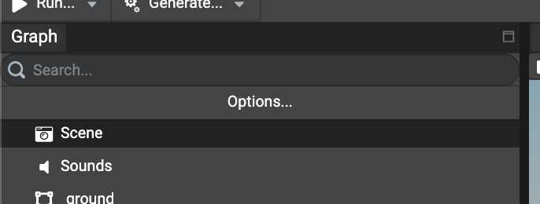
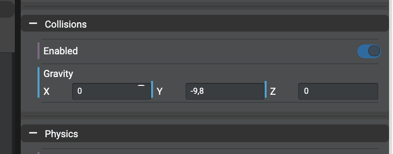
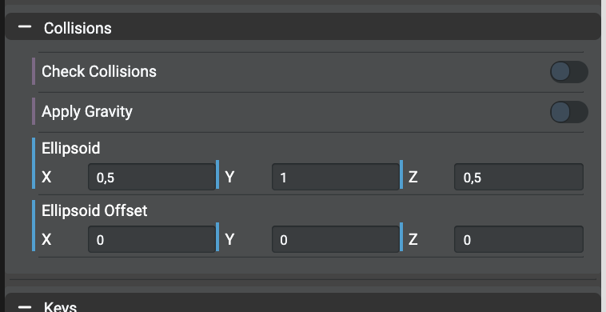
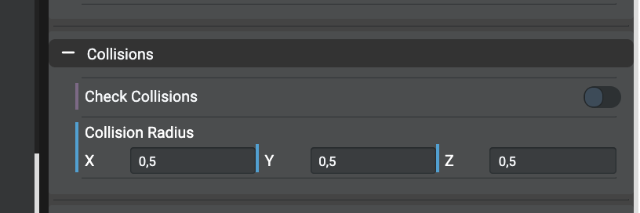
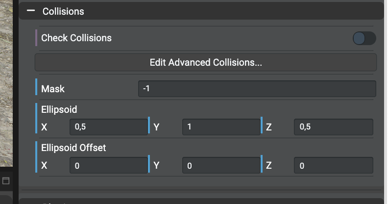

# Setting Basic Collisions
Using the inspector, collisions properties can be customized per object:
- `meshes`: set wether or not the edited mesh checks for collisions.
- `cameras`: set wether or not the edited camera checks collisions on meshes and if gravity should be applied.
- `scene`: set wether or not collisions are enabled in the scene and configure the gravity values.

## Enabling Collisions In Scene
To enable collisions in the scene, simply select the `Scene` in the graph:

And scroll in the inspector to find the section named `Collisions`:

To enable collisions, simply check the `Enabled` checkbox and provide the gravity values desired for the current scene.

## Enabling Collisions For Camera
Cameras don't necessary check for collisions by default. If your camera doesn't check for collisions, simply select the desired
camera in the graph and scroll in the inspector to find the section named `Collisions`.

*Note: According the type of the selected camera, no all properties will be shown. For example, the `Apply Gravity` option will not be shown
for `Arc Rotate Camera` as it makes no sense.*

### Free Camera
The cameras of type `FreeCamera` are the most common types of camera in projects. To enable collisions, simply check the
`Check Collisions` checkbox and configure the ellipsoid values. For ellipsoids, check the
[following documentation](https://doc.babylonjs.com/divingDeeper/cameras/camera_collisions#2-define-an-ellipsoid) in order to understand
and setup the desired values according the nature of the current scene being edited in the Editor.

The property `Apply Gravity`, if enabled, will apply the gravity previously set in the scene and can be disabled only by unchecking the
property.

### Arc Rotate Camera
As for the `FreeCamera`, the arc rotate cameras can have their collisions enabled using the checkbox `Enabled`.
Opposed to the free camera, the ellipsoid property is replaced by `Collisions Radius` property. Check the
[following documentation](https://doc.babylonjs.com/divingDeeper/cameras/camera_collisions#arcrotatecamera) in order to understand and setup
the desired value for the collisions radius.

## Enabling Collisions For Meshes
Once scene and camera(s) have been configured, the last step is to configure which mesh(es) will have collisions enabled in order
to block the camera.

To enable collisions, simply check the `Check Collisions` checkbox and configure its optional `Ellipsoid` and `Ellipsoid Offset` properties.
Don't hesitate to check as well the
[following documentation](https://doc.babylonjs.com/divingDeeper/cameras/camera_collisions#4-object-vs-object-collision) to
understand ellipsoid and ellipsoid offset properties on meshes.

## Using The ".moveWithCollisions" Method In Code
The Babylon.JS API provides a method named `.moveWithCollisions` on `Mesh` class. This method will work like for cameras without any,
extra configuration. It'll check collisions on all meshes that have collisions enabled in the scene.
