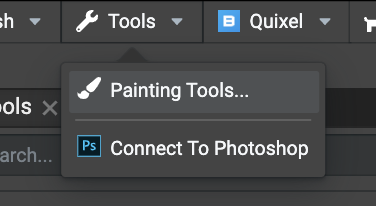
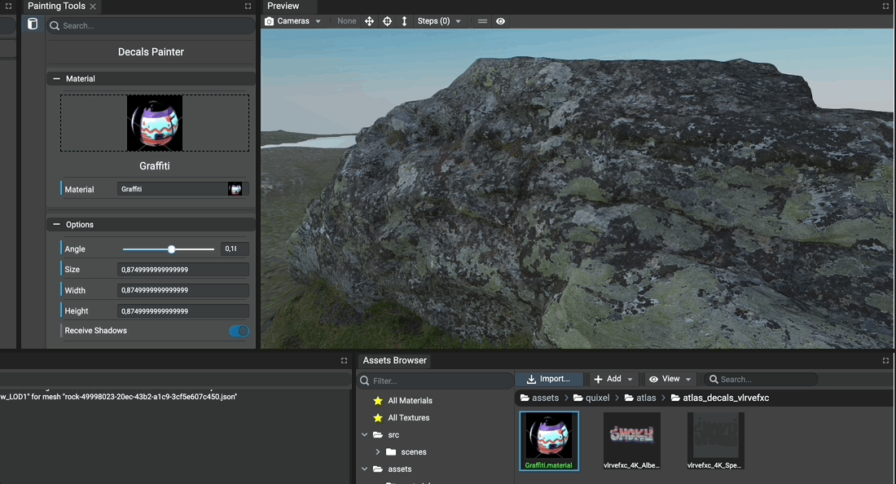
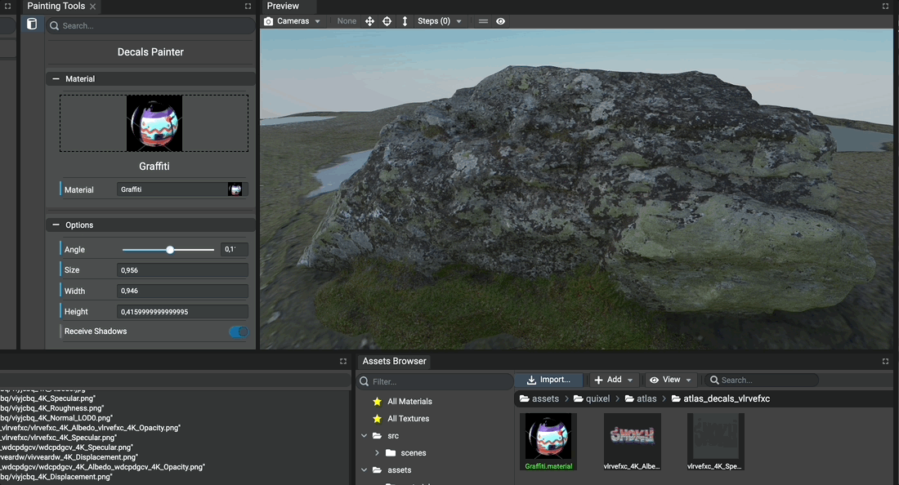

# Using Decals Painting Tool

## Introduction

The Editor provides a tool allowing to paint decals in the scene.
Decals are usually used to add details on meshes (bullets hole, local details, etc...), a decal is a mesh produced
from a subset of a previous one with a small offset in order to appear on top of it.

More information about decals can be found here: https://doc.babylonjs.com/divingDeeper/mesh/decals

To open the decals painting tool, simply open the `Painting Tools` panel using the main toolbar `Tools -> Painting Tools`.

## Setting Material

A decal is defined by at least a material and a position. To assign a material for the decals to paint, simply
select the material in the combo box `Material` or drag'n'drop the material asset on it.

In order to activate the decal painting tool in the preview, simply press the `CTRL` key and move the mouse on
the mesh the decal should be applied on. Once the result is satisfying, click in the preview panel and the decal
will be applied.

Once a decal has been painted, the generated mesh of the decal is available as a child of the mesh it is applied on.
Decals are considered as meshes in the Editor so they can be customized as any other mesh in the `Inspector` and the
`Graph`.

## Setting Decal Properties

Shortcuts are available in the Editor to edit these properties using keyboard and mouse:
- `CTRL + Mouse Wheel` to increment or decrement the `size` of the decal
- `CTRL + ALT + Mouse Wheel` to increment or decrement the `angle` of the decal

Each decal can be customized by:
- `width` (modifies only the width of the decal).
- `height` (modifies only the height of the decal).
- `position` (by moving the mouse as mentionned above).
- `angle` (in other words, the rotation of the decal on the mesh).
- `size` (both width and height are equal).

